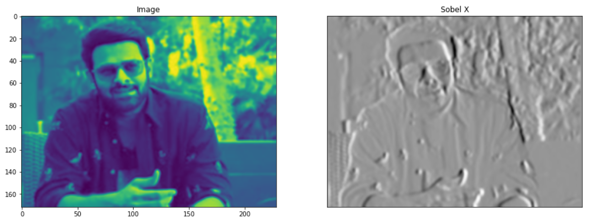
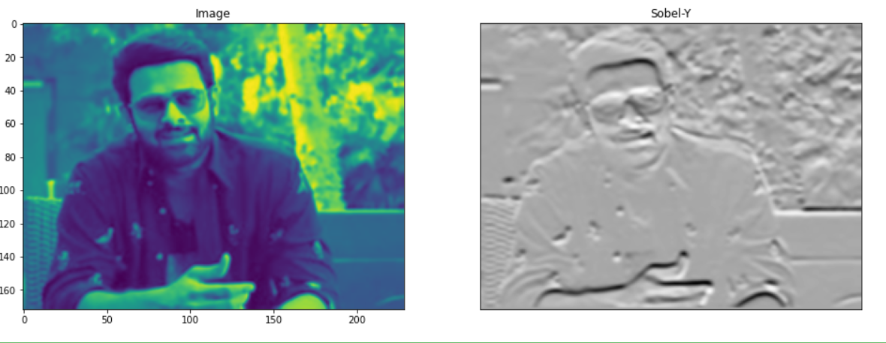
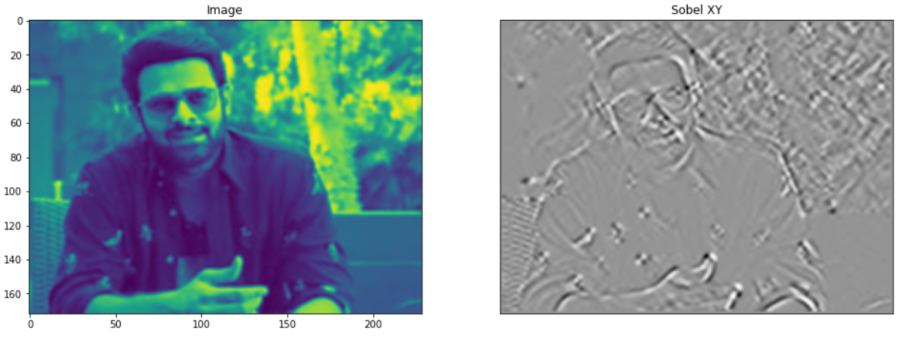
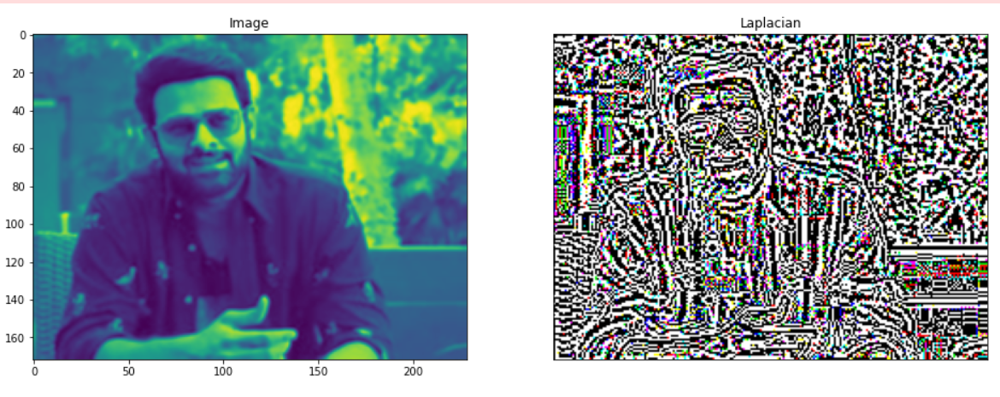
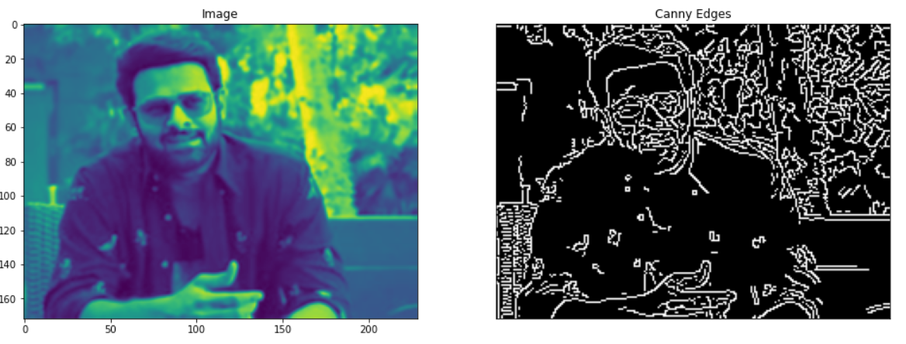

# Edge-Detection
## Aim:
To perform edge detection using Sobel, Laplacian, and Canny edge detectors.

## Software Required:
Anaconda - Python 3.7

## Algorithm:
### Step1:
Import the required packages for further process.


### Step2:
Read the image and convert the bgr image to gray scale image.

### Step3:
Use any filters for smoothing the image to reduse the noise.

### Step4:
Apply the respective filters -Sobel,Laplacian edge dectector and Canny edge dector.

### Step5:
Display the filtered image using plot and imshow.

 
## Program:

``` Python
# Import the packages

import cv2
import matplotlib.pyplot as plt
image=cv2.imread("dulquer.jpeg")

# Load the image, Convert to grayscale and remove noise

gray_img=cv2.cvtColor(image,cv2.COLOR_BGR2GRAY)
img=cv2.GaussianBlur(gray_img,(3,3),0)

# SOBEL EDGE DETECTOR

# SOBEL X

sobelx=cv2.Sobel(img,cv2.CV_64F,1,0,ksize=5)
plt.figure(figsize=(16,16))
plt.subplot(1,2,1)
plt.imshow(img)
plt.title('Image')
plt.subplot(1,2,2)
plt.imshow(sobelx,cmap='Greys')
plt.title("Sobel X")
plt.xticks([])
plt.yticks([])
plt.show()

# SOBEL Y
sobely=cv2.Sobel(img,cv2.CV_64F,0,1,ksize=5)
plt.figure(figsize=(16,16))
plt.subplot(1,2,1)
plt.imshow(img)
plt.title('Image')
plt.subplot(1,2,2)
plt.imshow(sobely,cmap='Greys')
plt.title("Sobel-Y")
plt.xticks([])
plt.yticks([])
plt.show()

# SOBEL XY
sobelxy=cv2.Sobel(img,cv2.CV_64F,1,1,ksize=5)
plt.figure(figsize=(16,16))
plt.subplot(1,2,1)
plt.imshow(img)
plt.title('Image')
plt.subplot(1,2,2)
plt.imshow(sobelxy,cmap='Greys')
plt.title("Sobel XY")
plt.xticks([])
plt.yticks([])
plt.show()

# LAPLACIAN EDGE DETECTOR
laplacian = cv2.Laplacian(image,cv2.CV_64F)
plt.figure(figsize=(16,16))
plt.subplot(1,2,1)
plt.imshow(img)
plt.title('Image')
plt.subplot(1,2,2)
plt.imshow(laplacian,cmap='gray')
plt.title("Laplacian")
plt.xticks([])
plt.yticks([])
plt.show()

# CANNY EDGE DETECTOR
canny_edges = cv2.Canny(image, 120, 150)
plt.figure(figsize=(16,16))
plt.subplot(1,2,1)
plt.imshow(img)
plt.title('Image')
plt.subplot(1,2,2)
plt.imshow(canny_edges,cmap='gray')
plt.title("Canny Edges")
plt.xticks([])
plt.yticks([])
plt.show()
```

## Output:
## SOBEL EDGE DETECTOR



## LAPLACIAN EDGE DETECTOR

## CANNY EDGE DETECTOR

## Result:
Thus the edges are detected using Sobel, Laplacian, and Canny edge detectors.
